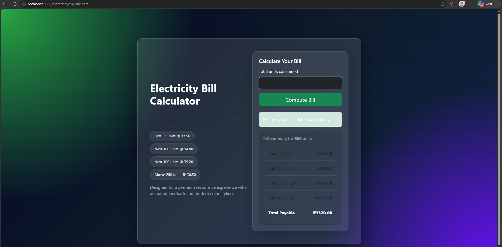

# Electricity Bill Calculator

A simple Java web application that calculates an electricity bill based on unit slabs.

## What is included

- Maven WAR project
- Servlet controller for bill calculation
- JSP front end
- `web.xml` configured for Tomcat 9 / Java EE servlet APIs

## Screenshot



## Files you should keep in git

- `pom.xml`
- `src/main/java`
- `src/main/webapp`
- `README.md`
- `.gitignore`

## Files you should not commit

- `.classpath`
- `.project`
- `.settings/`
- `target/`
- `apache-tomcat-9.0.100/`
- screenshot or log files that are only local editor output

## How to build

You need:

- JDK 17
- Apache Maven 3.8 or newer
- Apache Tomcat 9.x

Then from the project root run:

```bash
mvn clean package
